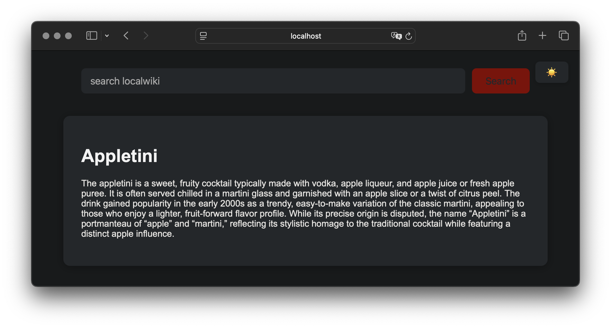

# localwiki

Your own personal wiki to run locally when you don't have access to the internet. This is very much a work in progress, and is primarily to serve my needs. Mostly built during one coding session while catching up on news - so please be patient :)

## Instructions

If you're on macOS, first install Homebrew on your system. Then use the Makefile to install dependencies and take it for a spin!

```bash
make install
make first-run
make serve
```

Now, you can go to `http://localhost:8000` in your browser to see your local wiki.



## Troubleshooting

To remove the sqlite db, run

```bash
make clean
```
